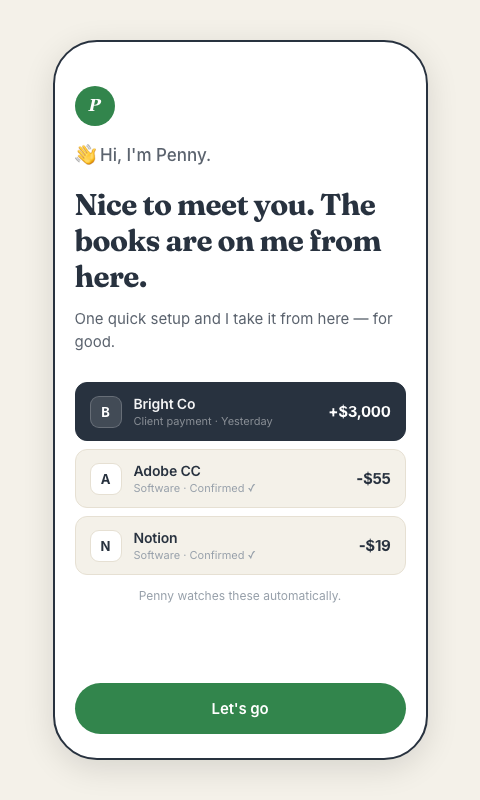

  

<h1 align="center">FounderFirst</h1>

<b>Meet Penny: she does your books while you sleep, and only taps you when she needs a call.</b>

  
  
  

  <b><a href="https://founderfirst.one">Live at founderfirst.one ↗</a></b> &nbsp;·&nbsp; source-available, this repository

<!-- DEMO_GIF -->

---

## What We're Building

FounderFirst builds the back-office tools that founders wish existed, starting with the biggest pain point: the books.

You started a business to do the work. Not to chase receipts, chase payments, or untangle a spreadsheet on a Sunday. Money moves across Stripe, your bank, your card, and the financial picture you need to make real decisions ends up spread across five different places. Every tool out there was built for accountants, not founders.

So we built something different.

---

## Penny, Our First Product

**Your autonomous 24/7 bookkeeper.**

No setup. No spreadsheets. Clean books, real profit, tax-ready.

Connect Stripe, your bank, your card, anywhere money moves. Penny categorizes every transaction. You confirm with one tap.

**What Penny gives you:**

- **Know what you're actually making.** Real profit, updated as the money moves, not just revenue.
- **Never chase a late payment again.** Penny sends professional reminders to late-paying clients, so you don't have to.
- **No scramble come tax season.** Books stay clean and CPA-ready, year round.

**For business owners:** No spreadsheets. No chasing receipts. Just clean books.

**For CPAs:** Every transaction categorized. Every receipt attached.

---

## How the AI works

Penny is built so that the money-critical common case never depends on a model guess, and the ambiguous case is grounded in the founder's own ledger before anything is proposed. The design is deterministic-first, and the model earns its way in only where it adds value.

- **Deterministic-first categorization.** The bulk of transactions are filed by a pure, dependency-free lexical matcher (learned rules plus vendor priors) in `supabase/functions/_shared/conduit-ff/deterministic.ts`. It is the exact predicate the DB-backed path enforces in production, so the common case is filed with zero model spend, no API key, and no network.
- **A bounded Conduit agent loop for the hard cases.** When a transaction is genuinely ambiguous, the generative step becomes a bounded reason-act loop (`investigator.ts`). The loop runs with no side-effect authority, every tool is read-only, and a never-finishing model stops at a step cap and yields no proposal (fail-safe).
- **Grounded via BM25 RAG over the founder's real ledger.** The loop retrieves against the founder's own corpus with a BM25 lexical retriever (`retrieval.ts`). Lexical is the right default for short accounting labels. When the top hit falls below the score threshold, retrieval returns `grounded: false` with empty context rather than inventing support.
- **Difficulty routing across model rungs.** Straightforward, confident cases run on a cheap Haiku-class rung; a low-confidence draft escalates once to a reasoning tier, and only the genuinely hard case reaches the top rung. Spend follows difficulty instead of pinning one model to every transaction.
- **Fail-closed gates and the byId grounding gate.** The deterministic financial gates stay exactly where they were: a proposed account must resolve against the live chart of accounts by id, the SQL reconciler still runs, and the recategorize and autopost RPCs remain the only writers. The agent loop weakens no gate; it only replaces how a proposal is drafted.
- **Read-only, tenant-scoped MCP server.** The MCP surface (`tools/ff-mcp`) exposes ledger tools that are strictly read-only and structurally tenant-isolated: every tool takes an `org_id`, and there are no write tools, so the surface cannot mutate a ledger.

**Labeled fixture on the deterministic path.** A hand-labeled 40-row fixture (11 accounts, invented and neutral vendor names) scores the deterministic categorizer offline in CI, with no API key, no database, and no network. It is a labeled fixture, not production data and not a measure of live accuracy. On the committed fixture the deterministic path measures **82.5% overall accuracy** and **85.6% macro F1**. The recall gap is honest by design: the deterministic path declines to `Uncategorized` on ambiguous rows rather than guess, because a confident wrong number is worse than a question. Full method in [docs/EVALS.md](docs/EVALS.md).

---

## Try the Demo

Penny is live as an interactive demo. Two views, both clickable:

- **[Business owner view →](https://founderfirst.one/penny/demo/):** the mobile experience. Onboarding, the Penny conversation thread, one-tap approval cards, capture (photo / voice / upload / "just tell me"), My Books, and the invoice designer.
- **[CPA view →](https://founderfirst.one/penny/demo/cpa/):** what your accountant sees: client work queue, P&L, cash flow, learned rules, and a chat surface to ask Penny questions about the books.

The demo runs on real Claude responses through a Cloudflare Worker, so what you see is the actual product voice and intelligence, not canned screens.

---

## Early Access

Penny is in early access. **3 months on us** for waitlist members, and each founder you refer adds a free month, up to 12 total.

We're opening in small batches. **[Join the waitlist →](https://founderfirst.one)**

---

## About

FounderFirst is built by [Nik Jain](https://github.com/nikjain15), three-time founder, Forbes 30 Under 30 Asia.

The mission is simple: give business owners the back-office support that used to only exist inside bigger companies.

---

## Docs

Product and engineering deep-dives, grounded in this repository's code:

- **[docs/PRD.md](docs/PRD.md):** personas, jobs-to-be-done, success metrics, tradeoffs, and the Now/Next/Later roadmap.
- **[docs/ARCHITECTURE.md](docs/ARCHITECTURE.md):** system overview with component and sequence diagrams, grounded in real code paths.
- **[docs/EVALS.md](docs/EVALS.md):** the eval strategy (unit → deterministic gates → SQL reconciliation → LLM-judge panel → A/B), built on the real `packages/inference` harness.
- **[docs/TECHNICAL_NOTES.md](docs/TECHNICAL_NOTES.md):** file-level evidence for the model, orchestration, guardrail, and cost details.
- **[docs/MCP.md](docs/MCP.md):** the read-only, tenant-scoped MCP server (`tools/ff-mcp`), its four ledger tools, the isolation model, and the local + hosted transport shapes.
- **[docs/FDE_JOURNEY.md](docs/FDE_JOURNEY.md):** how Penny deploys into a live financial environment: integration, security, cutover, observability, de-risking.

A small self-contained gate eval harness lives in **[evals/](evals/README.md)** (`pnpm eval:gates`).

---

## Finding your way around

**[docs/README.md](docs/README.md) is the map:** where every kind of document lives,
the rules for adding or moving one, and the docs PR checklist. The short version:
the repo root holds only this file, [LEARNINGS.md](LEARNINGS.md) (engineering rules
from real incidents, read before non-trivial work), and [VOICE.md](VOICE.md) (the
brand voice). Specs live next to the code they govern (`apps/*`, `packages/*`,
`tools/*`); plans and roadmaps live in [docs/plans/](docs/plans/); finished or
superseded docs move to [docs/archive/](docs/archive/). Don't add a doc anywhere
else, find its home in the map first.

---

## Engineering guardrails

**Responsive standard:** every page, tab, and component must render correctly at any viewport width from 320px to 1920px+. Full rules in [apps/admin/RESPONSIVE.md](apps/admin/RESPONSIVE.md). Quick version:

1. Fluid first (`clamp`, `min`, `max`, `flex-wrap`, `grid auto-fit`); breakpoints only when a layout must change shape.
2. No hardcoded pixel widths in horizontal layouts, use `minmax(0, …)` so tracks can shrink.
3. Touch targets ≥ 44×44 px (`min-height: var(--tap-min)`).
4. Tables go inside `.table-wrap` for horizontal scroll + edge-fade affordance.
5. Inputs ≥ 16px font-size (prevents iOS auto-zoom).
6. Fixed-position elements (Penny bubble, cookie banner) must not cover CTAs at any width.

**Width-ladder test before merging any new UI:** 320 · 360 · 375 · 414 · 480 · 540 · 640 · 768 · 834 · 1024 · 1280 · 1440 · 1920. At each, `document.documentElement.scrollWidth > innerWidth` must be `false`.

**Design tokens:** all color, spacing, radius, and font-size come from [packages/design-system/tokens.css](packages/design-system/tokens.css). Never inline hex values or magic px.

**Blog:** every blog post follows [apps/web/BLOG_PRINCIPLES.md](apps/web/BLOG_PRINCIPLES.md): DB-first publishing, typed content blocks, a unique on-topic hero per post, uniform `/blog` layout, [VOICE.md](VOICE.md) tone, and the SEO/GEO + ship checklist. Read it before adding or editing a post.

**Podcast:** *Penny by FounderFirst* episodes follow [apps/web/PODCAST_PRINCIPLES.md](apps/web/PODCAST_PRINCIPLES.md): the one playbook for voice/script (two hosts, guest persona from Signals, educational-first, the guest never sells), audio (ElevenLabs v3, Penny = Matilda, guest = George), website (the `Podcast`-tagged post with the `PennyPodcast` inline-player hero), and the end-to-end publish flow. Read it before producing an episode.

---

*© 2026 FounderFirst. All rights reserved.*
