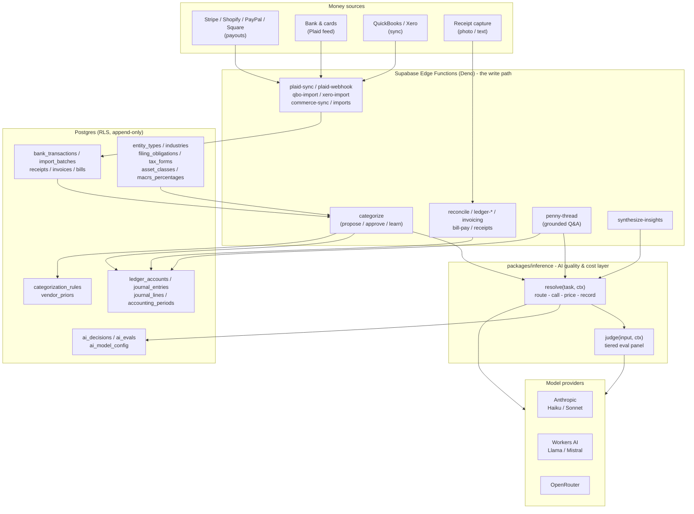
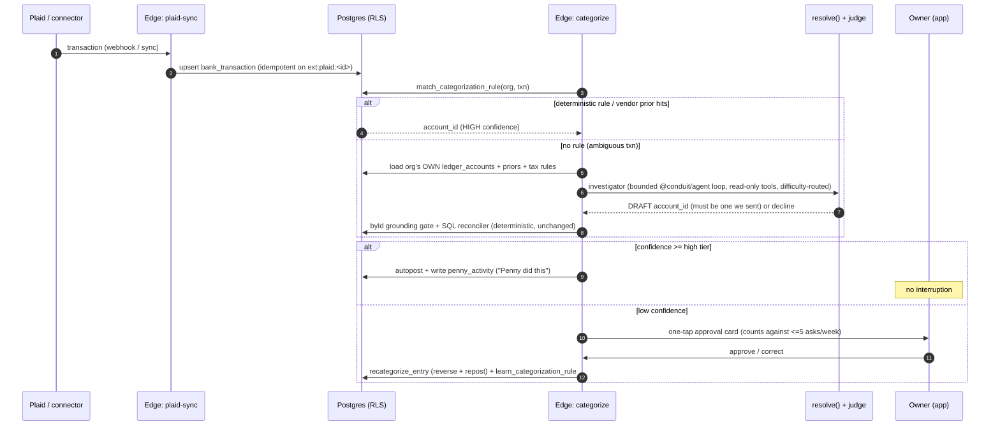

# FounderFirst / Penny, Architecture

> System overview grounded in the actual code paths in this repository. For the
> internal design record with decision history see
> [`docs/plans/ARCHITECTURE.md`](plans/ARCHITECTURE.md); this document is the
> external-facing map.

## 1. One platform, three lenses, one ledger

FounderFirst is a pnpm monorepo. The backend is **Supabase** (Postgres with
row-level security, Deno Edge Functions, Storage, Vault); the apps are thin
projections over it. The owner app, the CPA view, and the internal admin are all
role-scoped projections of **one platform and one set of books:** the lens is
selected server-side from the verified JWT, never from the browser.

| Layer | What it is | Stack (verified) |
|---|---|---|
| `apps/web` | Marketing site (the live founderfirst.one) | Astro 4 + React islands, GitHub Pages |
| `apps/app` | Authed product SPA, owner, CPA, and admin lenses | Vite 5 + React 18 + react-router + TanStack Query |
| `apps/admin` | Internal console (content, voice, signals, email) | Vite + React 18 SPA |
| `apps/demo` | Interactive Penny demo (`/penny/demo/`) | Vite + React 18, standalone |
| `site-bubble/worker` | Public marketing chat bubble | Cloudflare Worker + Workers AI |
| `supabase/functions` | ~74 Deno Edge Functions, the write path and Penny's brains | Deno + `@supabase/supabase-js` |
| `packages/inference` | The AI quality & cost layer (`resolve()` + judge) | Runtime-agnostic TypeScript |
| `supabase/functions/_shared/conduit` | Vendored Conduit primitives (`agent` loop, `client`, `mcp` ToolRegistry, `rag`) | Deno, no external deps |
| `supabase/functions/_shared/conduit-ff` | FounderFirst's Conduit wiring: the categorization investigator, BM25 retriever, embedded client, MCP tools, usage reporter | Deno TypeScript |
| `tools/ff-mcp` | Read-only, tenant-scoped MCP server (stdio) over the ledger | Deno / Node, dynamic MCP SDK |
| `packages/design-system` | Design tokens + components | CSS custom properties |
| `scripts/` | Seed loaders, CI guards, the regulatory watcher | tsx |

Design invariants that shape everything below:

- **Money is integer minor units** (`bigint` cents + currency), never floating point.
- **The ledger is append-only.** A correction is a new reversing entry that
  references the original; posted entries are never mutated.
- **Every financial table carries `org_id` and is RLS-protected.** The database
  itself refuses unauthorized reads; `resolve()` throws on an empty tenant; a CI
  guard (`scripts/check-tenant-predicate.ts`) fails the build on any query that
  touches a tenant table without a tenant predicate.
- **Business/law knowledge is data, not code.** Tax rules, deadlines, entity
  types, and connectors are seed data; apps look them up and never hardcode them
  (`scripts/check-law-literals.ts` enforces this in CI).

## 2. Component view



Two properties are worth calling out. First, **every AI request in the system funnels
through one `resolve()`** (`packages/inference/src/core.ts`), there is a single
place where routing, cost, and logging happen, and a single provider HTTP path that
the judge reuses. Second, **the knowledge kernel feeds categorization and tax as
data**, so a new sector, deadline, or connector is a seed-file edit with a CI drift
guard, not a code change.

## 3. The grounded categorization sequence

This is the core money-critical loop. It shows why "answers retrieved, not guessed"
is a structural property, not a prompt hope.



Key code facts (`supabase/functions/categorize/index.ts`,
`supabase/migrations/*phase4_categorization.sql`, `*w3_2_trust_tiered_autonomy.sql`):

- **Deterministic first, model second.** The rule matcher (`match_categorization_rule`)
  plus the learned vendor prior run before any model call, and resolve the bulk of
  transactions with zero model spend; the model path is only a fallback for the
  genuinely ambiguous remainder.
- **The ambiguous path is a bounded agent, not a single call.** When no rule or
  prior hits, `categorize` hands the transaction to the investigator
  (`_shared/conduit-ff/investigator.ts`), a bounded `@conduit/agent` reason-act
  loop. The model may call four read-only tools (get_transaction, list_accounts,
  prior_categorizations, tax_rule_lookup) to gather evidence grounded in the
  founder's own data, then drafts one proposal. The loop is bounded by a step cap;
  a never-finishing model stops at the cap and yields no proposal (fail-safe). It
  runs without side effects, so it can only ever return a DRAFT.
- **The model cannot invent an account.** The drafted `account_id` is re-checked
  against the org's live chart (`byId`) in the caller; anything not in the set we
  handed the model is rejected. This deterministic grounding gate, the SQL
  reconciler, and the `recategorize_entry` / `autopost_categorization` write RPCs
  are untouched by the agent, which only proposes.
- **Difficulty routing.** The investigator routes by difficulty across three model
  rungs rather than pinning one model per transaction: a cheap Haiku-class tier for
  confident cases, escalating once to a Sonnet-class reasoning tier on low
  confidence or a weak-retrieval / ungrounded-rationale signal, and to an
  Opus-class tier when a pass hits its step cap or returns no grounded draft. A
  pre-model retrieval check can also start the cascade higher. Spend is bounded to
  at most two model passes; every rung is a normal metered, cap-aware `resolve()`
  call. Set `CONDUIT_DIFFICULTY_ROUTING=0` to pin the cheap tier.
- **Grounded by RAG over the founder's real corpus.** The investigator's retriever
  (`_shared/conduit-ff/retrieval.ts`, on `@conduit/rag`) indexes the org's own
  chart of accounts, prior categorizations, and tax-rule text with BM25 (lexical is
  the right default for short accounting labels and vendor strings, and there is no
  embedding call on the Edge runtime). A weak-retrieval gate makes the path say
  "not found" instead of inventing. Every model turn is routed through an embedded
  `@conduit/client` (`_shared/conduit-ff/client.ts`) that injects FounderFirst's own
  `resolve`, so the agent and client surfaces run on one real path.
- **Trust-tiered autonomy.** High-confidence items auto-post and appear in a
  "Penny did this" activity feed; only low-confidence items become approval cards,
  and the owner is interrupted at most ~5 times a week (config is data in
  `platform_config`, read via `get_effective_behavior_config`).
- **Learning is a ledger event.** Approve runs `recategorize_entry` (reverse +
  repost) and `learn_categorization_rule` (upsert), so the books stay append-only
  and the correction is remembered. Corrections can auto-demote a rule.

## 4. The grounded Q&A path (Penny thread)

`supabase/functions/penny-thread/index.ts` is the clearest expression of the
grounding discipline. The client computes a fast optimistic answer, but the server
is authoritative on every request:

1. **Re-route** the question with shared routing logic, if the server deems it out
   of scope, it declines regardless of what the client sent.
2. **Re-compute the fact** from the org's own ledger via a paginated service-role
   SELECT running the exact report math. The server figure wins over any client
   figure; a forged client amount is discarded.
3. **Post-check the model.** The model only phrases the server fact; if it emits any
   figure other than the server fact, that output is discarded for deterministic
   phrasing.

The result: a hallucinated or client-forged number is structurally impossible. Empty
books defer to "connect your books first" rather than report a hollow `$0.00`.

## 5. The AI quality & cost layer

Every AI request passes through `resolve(task, ctx)`:

- **Routing** is config-driven (`DEFAULT_ROUTING`, overridable from the DB via
  `buildInferenceConfig`): `penny_chat` -> Claude Haiku (fast), `insights` ->
  Claude Sonnet (reasoning), `email_compose` -> Llama 3.3 70B on Workers AI
  (writing/bulk). Providers: `anthropic`, `workers-ai`, `openrouter`.
- **Cost** is priced per token (`computeCostUsd`) and recorded on an `ai_decisions`
  row with latency and usage; spend caps trigger a fallback model, never a failure.
- **Portability by construction.** The core depends on no runtime globals; `fetch`,
  timers, the Workers-AI binding, and the record sink are injected via `ctx`, so the
  same logic runs in a Cloudflare Worker, a Supabase Edge (Deno) function, and Node
  (CI). The Deno copy is vendored into `supabase/functions/_shared/inference/` with a
  CI drift guard (`scripts/check-inference-vendor.ts`).
- **Grading** is a tiered eval panel (`judge()`): deterministic floor gates ->
  optional SQL reconciliation -> a generator-family-aware LLM checker panel, with a
  fail-closed default. Detail in [EVALS.md](EVALS.md).
- **Conduit integration.** The categorization investigator drives every model turn
  through an embedded `@conduit/client` that injects this same `resolve`, so no new
  inference core is introduced. An env-gated usage reporter
  (`_shared/conduit-ff/usageReporter.ts`) mirrors each metered decision to a Conduit
  gateway for live spend/latency observability. It is a **no-op unless both
  `CONDUIT_GATEWAY_URL` and `CONDUIT_GATEWAY_TOKEN` are set**, never blocks, and
  never throws, so it cannot affect an answer.

## 5a. Read-only MCP surface

The same ledger tools the in-app investigator uses are exposed to external MCP
clients (Claude Desktop, agent runtimes) through a **read-only, tenant-scoped** MCP
server (`tools/ff-mcp/server.ts`), built on the vendored `@conduit/mcp` ToolRegistry
so the tools validate and behave identically in-process and over MCP. Four tools:
`ff_list_ledger_accounts`, `ff_get_transaction`, `ff_prior_categorizations`, and
`ff_tax_rule_lookup` (which runs the same RAG grounding and returns not-found rather
than inventing a rule). Every tool takes an `org_id` and resolves a
membership-guarded, org-bound accessor; there are no write tools and no cross-tenant
reads. It runs over stdio locally; the intended hosted shape serves the same
registry over MCP Streamable HTTP / SSE behind the app's auth. Detail in
[MCP.md](MCP.md).

## 6. Data architecture (canonical ledger + adapters)

```
Ingest (raw, provenance-preserving)          Canonical books (append-only)
  Plaid    -> bank_transactions               ledger_accounts   (chart of accounts)
  QBO/Xero <-> external_connections           journal_entries   (immutable header)
  Commerce -> commerce payouts (split)        journal_lines     (debit/credit rows)
  Manual   -> import_batches / receipts        documents / receipts (Storage)
                                              categorization_rules (Penny-learned)
                                              accounting_periods (open/closed, close)
                                              reconciliation_sessions / matches
```

- Own ledger is canonical; Plaid, QBO/Xero, and commerce providers are adapters
  behind one provider interface (`connectors` seed table). The ledger does not care
  where a transaction originated; every entry keeps `source` + `source_ref`
  provenance.
- Every money mutation is idempotent (client-supplied key; webhook ingest dedupes
  on the provider transaction id).
- Reports (P&L, balance sheet, cash flow) are derived from the ledger, not stored as
  truth.

## 7. Security and tenancy

- **RLS everywhere.** `can_access_org` / `can_read_org` / `can_write_org_as`
  security-definer helpers gate every financial table. Read-only CPA access
  (`access_level = read_only`) is enforced in the RPC, not just the UI.
- **The write path is RPC-only.** Financial tables deny direct client writes;
  mutations go through `SECURITY DEFINER`, `service_role`-EXECUTE-only RPCs
  (`post_journal_entry`, `reconcile`, `recategorize_entry`, ...), with the actor
  taken from the verified JWT and each RPC audit-logging.
- **Penny has no privilege escalation path and no authority.** It reads only
  RLS-permitted data and writes only proposals a human approves; it never silently
  mutates the ledger. An MFA gate (`_shared/mfaGate.ts`) guards sensitive write ops.
- **Secrets** live in Edge Function config / Supabase Vault, never client-side.

## 8. Delivery and CI

16 GitHub Actions workflows cover the repo, including `db-tests.yml` (58 pgTAP SQL
test files), `deno-tests.yml` (edge-function tests, which is also where the labeled
categorization eval floor runs), `app-e2e.yml` / `e2e.yml` (Playwright),
`kernel-seed.yml` (seed-drift), `regulatory-watcher.yml`, `responsive.yml` (a
320-1920px width ladder), `migrations-unique.yml`, and `pages.yml` (deploy). Not all
16 gate a pull request: `pages.yml`, `deploy-worker.yml` and `deploy-bridge.yml` run
on push to `main`, and `regulatory-watcher.yml` is scheduled. See
[EVALS.md](EVALS.md) §8a for exactly which checks block a merge. The local `build`
script chains the CSS guard, the tenant guard, the definer-guard, the inference
vendor-drift guard, and the judge unit tests before building, which is how those
five reach every non-docs pull request.

---

*Related: [PRD.md](PRD.md) · [EVALS.md](EVALS.md) ·
[TECHNICAL_NOTES.md](TECHNICAL_NOTES.md) · [FDE_JOURNEY.md](FDE_JOURNEY.md)*
